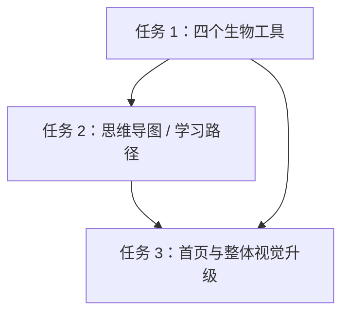

# BioMentor Agent 三个任务详细总清单

> 创建日期：2026-05-28  
> 适用范围：任务 1「四个生物工具确认完善」、任务 2「思维导图模块」、任务 3「首页与整体前端视觉升级」  
> 当前原则：不改变网站 6 个主功能模块；四个工具是「生物工具箱」内部能力；思维导图归入「知识图谱 / 学习路径」能力；前端升级只改呈现与体验，不新增业务功能。

---

## 0. 总体边界与共识

### 0.1 网站主功能保持 6 个

主导航与产品主线保持为：

1. 知识探索
2. 科研实战
3. 生物工具箱
4. 产业案例
5. 知识图谱
6. 学术研讨

明确不把「四个工具」提升为全站主线，也不新增第 7 个一级导航。

### 0.2 三个任务之间的关系



- **任务 1**：把「生物工具箱」内部的 4 个工具做成真正可用、可演示、可教学的工具。
- **任务 2**：把「思维导图」做成学习路径组织器，建议归入「知识图谱」模块，不单独占主导航。
- **任务 3**：统一浅色液态玻璃视觉，重点重做首页与导航，再逐步带动各模块页面观感。

### 0.3 全局禁止项

- [ ] 公共页面不展示 `/api/...`、fallback、后端状态、二进制工具名、调试信息等开发者内容。
- [ ] 不在首页突出「四个工具」超过 6 个主功能模块。
- [ ] 不继续保留右侧「开始测评」按钮，因为当前阶段不做该功能。
- [ ] 不虚构用户数、案例数、题库数等无法证明的数据。
- [ ] 不为了炫技加入过度动效、粒子爆炸、强闪烁、大量滚动特效。

---

# 任务 1：四个生物工具确认完善

## 1.1 总体定位

四个工具属于「生物工具箱」模块内部能力，目标不是做成完整商业级生信平台，而是做成：

> 面向生物学习场景的、可真实操作的、带教学解释的轻量生物工具集合。

优先保证：

- 可搜索 / 可输入 / 可上传
- 有可视化结果
- 有教学解释
- 有默认高质量示例
- 演示时稳定
- 失败时不崩溃

## 1.2 技术策略

### 第一阶段：前端优先，可真实调用公共资源

- 蛋白结构：优先接公共结构数据源，如 RCSB PDB、UniProt、AlphaFold DB。
- 质粒图谱：前端解析内置数据、GenBank、FASTA。
- 序列分析：纯前端完成基础分析，保证离线也能跑。
- 通路图谱：前端内置精选通路数据，强调交互与解释。

### 第二阶段：后端增强，但不阻塞第一版

后端可作为未来增强：

- API proxy / 缓存，避免公共 API 限流。
- pLannotate / BLAST+ / Primer3 等二进制或服务化工具。
- 用户上传文件持久化。
- AI 解释与报告生成。

当前不要求重型后端才能上线。

---

## 1.3 蛋白结构查看器

### 目标

从「示例结构展示」升级为「可以自己搜索蛋白并查看结构的教学工具」。

### 功能清单

- [ ] 支持搜索蛋白名、基因名、PDB ID、UniProt ID。
- [ ] 输入 PDB ID 时直接加载实验结构。
- [ ] 输入 UniProt ID 时尝试加载 AlphaFold 预测结构。
- [ ] 输入关键词时显示候选列表，而不是直接硬跳到一个结果。
- [ ] 候选列表显示：蛋白名、物种、结构来源、简短说明。
- [ ] 用户点击候选后加载 3D 结构。
- [ ] 3D 结构区域具有加载中、成功、失败、空结果状态。
- [ ] 支持 cartoon / stick / sphere 等基础展示切换。
- [ ] 支持重置视角。
- [ ] 展示结构来源，但使用用户能理解的话，例如「实验结构」「预测结构」。
- [ ] 不显示内部 API、fallback、调试日志。

### 教学解释

- [ ] 解释该蛋白的核心功能。
- [ ] 解释结构域 / 功能区。
- [ ] 解释实验结构与预测结构区别。
- [ ] 给出至少 1 个理解问题。

### 默认示例

建议默认提供：

- GFP
- Hemoglobin / 4HHB
- TP53
- Cas9
- Insulin

### 验收样例

- [ ] 搜 `GFP` 能看到候选并加载结构。
- [ ] 搜 `4HHB` 能看到血红蛋白结构。
- [ ] 搜 `Cas9` 能看到相关候选。
- [ ] 搜不存在内容时出现友好空状态。
- [ ] 公共结构加载失败时页面不崩溃。

---

## 1.4 质粒图谱查看器

### 目标

从「静态质粒图」升级为「能选择经典质粒、上传序列、点击元件解释的教学型质粒图谱」。

### 功能清单

- [ ] 内置经典质粒：pBR322、pUC19、pET-28a、pGEX。
- [ ] 每个内置质粒包含关键元件：ori、抗性基因、promoter、MCS、tag、terminator。
- [ ] 支持上传 GenBank `.gb` / `.gbk`。
- [ ] 支持上传 FASTA `.fa` / `.fasta`。
- [ ] GenBank 自动解析 `FEATURES`。
- [ ] FASTA 显示为未注释序列轨道，并提示上传 GenBank 可获得完整元件。
- [ ] 环形图谱按 feature 坐标绘制。
- [ ] 右侧显示元件列表。
- [ ] 点击元件时高亮图谱对应区域。
- [ ] 当前选中元件显示解释卡片。
- [ ] 上传失败或格式不支持时有友好提示。

### 教学解释

- [ ] 解释 ori 的作用。
- [ ] 解释抗性基因用于筛选。
- [ ] 解释 promoter 控制表达。
- [ ] 解释 MCS 用于插入外源片段。
- [ ] 解释 tag / terminator 等表达载体元件。
- [ ] 给出实验设计引导问题。

### 验收样例

- [ ] 选择 pET-28a 能看到 T7 promoter、His-tag、KanR。
- [ ] 上传 GenBank 后能生成图谱。
- [ ] 点击 AmpR 后右侧解释抗性筛选。
- [ ] 上传 FASTA 后显示未注释序列提示。

---

## 1.5 序列分析工具

### 目标

从「简单数字统计」升级为「序列理解、实验检查和基础设计工具」。

### 功能清单

- [ ] 自动识别序列类型：DNA、RNA、Protein、Invalid / Mixed。
- [ ] 支持 FASTA header 清洗。
- [ ] 显示长度、GC%、AT%、碱基组成。
- [ ] 支持 DNA → RNA 转录。
- [ ] 支持反向互补链。
- [ ] 支持 DNA 翻译蛋白序列。
- [ ] 支持 ORF 查找。
- [ ] 检测常见酶切位点：EcoRI、BamHI、HindIII、XhoI、NdeI。
- [ ] 酶切位点在序列中高亮。
- [ ] 引物设计结果包含 forward primer、reverse primer、Tm、GC%、产物长度、风险提示。
- [ ] 分析结果随输入实时更新。

### 教学解释

- [ ] 解释 GC% 对 PCR 的影响。
- [ ] 解释 ORF 是否完整。
- [ ] 解释酶切位点能否用于克隆。
- [ ] 解释引物合理性与风险。

### 验收样例

- [ ] 输入 DNA 能识别为 DNA。
- [ ] 点击转录得到 RNA。
- [ ] 点击反向互补得到 reverse complement。
- [ ] 能找出最长 ORF。
- [ ] EcoRI / BamHI 位点能显示位置并高亮。

---

## 1.6 通路知识图谱

### 目标

从「画节点」升级为「机制关系学习工具」，并与思维导图 / 学习路径建立入口关系。

### 功能清单

- [ ] 至少支持 5 个通路：细胞周期、细胞凋亡、MAPK、DNA 修复、糖酵解。
- [ ] 图谱布局稳定。
- [ ] 节点可点击。
- [ ] 边可点击。
- [ ] 右侧显示当前节点 / 边解释。
- [ ] 支持高亮上下游。
- [ ] 支持推荐学习路径。
- [ ] 增加「生成 / 查看思维导图」入口，跳转到知识图谱模块下的思维导图视图。

### 教学解释

- [ ] 解释激活关系。
- [ ] 解释抑制关系。
- [ ] 解释磷酸化等调控方式。
- [ ] 解释关键节点。
- [ ] 解释疾病 / 实验关联。

### 验收样例

- [ ] 点击 p53 显示 p53 解释。
- [ ] 点击 p53 → p21 显示调控关系。
- [ ] 点击推荐学习路径能看到学习顺序。
- [ ] 点击思维导图入口能进入对应主题视图。

---

## 1.7 任务 1 总体验收

- [ ] 四个工具都可以从 `/tools` 进入。
- [ ] 每个工具都有默认示例。
- [ ] 每个工具都支持用户主动输入 / 搜索 / 上传 / 选择。
- [ ] 每个工具都有可视化结果。
- [ ] 每个工具都有教学解释。
- [ ] 所有错误状态友好。
- [ ] 不出现开发者信息。
- [ ] `node --test frontend/lib/biotools.test.mjs` 通过。
- [ ] `npm run build` 通过。
- [ ] 部署后公网可访问。

---

# 任务 2：思维导图模块

## 2.1 模块定位

思维导图不是普通树状脑图，也不是生物通路图谱。它应该定位为：

> 学习路径组织器：帮助学生理解知识层级、当前学习位置、下一步应该学什么，以及可以调用哪些工具辅助理解。

### 与知识图谱的关系

由于网站主导航只有 6 个模块，思维导图不单独新增一级导航，建议归入「知识图谱」模块。

推荐入口方式：

- `/knowledge-map` 页面中增加「知识图谱 / 思维导图」视图切换。
- 或新增子路由 `/knowledge-map/mindmap`，但导航仍然指向「知识图谱」。
- 通路工具中的「生成思维导图」跳转到该视图，并携带主题参数。

---

## 2.2 核心体验：渐进展开式 BioMind Map

### 设计原则

- [ ] 默认只显示中心节点和一级主题。
- [ ] 点击一级节点后展开子节点。
- [ ] 点击二级节点后显示详细解释。
- [ ] 当前路径高亮。
- [ ] 非当前分支降低透明度。
- [ ] 图上只放短词，详细内容放右侧面板。
- [ ] 节点具有学习状态：已掌握、需复习、薄弱、推荐下一步、未学习。

### 页面布局

```text
顶部：主题切换 / 视图切换 / 进度提示
左侧：主题目录或学习主题列表
中间：动态 radial / orbit mind map
右侧：节点解释 + 推荐工具 + 推荐练习 + 下一步
```

### 推荐视觉

- 浅色液态玻璃背景。
- 中心节点有柔和 glow。
- 分支线条从父节点生长出来。
- 点击展开有平滑过渡。
- 右侧详情面板使用 glass-card 风格。
- 背景可以有极轻分子网络纹理，但不能喧宾夺主。

---

## 2.3 默认地图内容

```text
生物制造基础
├── 分子生物学基础
│   ├── DNA
│   ├── RNA
│   ├── 蛋白质
│   ├── 中心法则
│   └── 基因表达调控
├── 合成生物学工具
│   ├── 质粒载体
│   ├── 启动子
│   ├── 终止子
│   ├── 筛选标记
│   ├── CRISPR-Cas
│   └── 报告基因
├── 序列分析与设计
│   ├── GC 含量
│   ├── ORF
│   ├── 引物设计
│   ├── 酶切位点
│   └── 序列比对
├── 蛋白结构与功能
│   ├── 一级结构
│   ├── 二级结构
│   ├── 三级结构
│   ├── 活性位点
│   ├── 结构域
│   └── 突变效应
├── 细胞通路与调控
│   ├── 细胞周期
│   ├── 细胞凋亡
│   ├── MAPK 通路
│   ├── DNA 修复
│   └── 代谢通路
└── 实验设计与验证
    ├── PCR
    ├── 分子克隆
    ├── 蛋白表达
    ├── 纯化检测
    └── 数据分析
```

---

## 2.4 与四个工具联动

- [ ] 蛋白结构相关节点 → 蛋白结构查看器。
- [ ] 质粒载体 / 启动子 / 筛选标记 → 质粒图谱查看器。
- [ ] GC 含量 / ORF / 引物设计 / 酶切位点 → 序列分析工具。
- [ ] 细胞周期 / 凋亡 / MAPK / DNA 修复 → 通路知识图谱。

节点详情面板中应显示「推荐工具」入口，而不是只在页面底部放链接。

---

## 2.5 节点详情面板内容

每个节点至少包含：

- [ ] 一句话解释。
- [ ] 需要掌握的关键点。
- [ ] 推荐工具入口。
- [ ] 推荐练习。
- [ ] 下一步学习建议。

示例：

```text
节点：质粒载体

一句话解释：
质粒是常用于基因克隆和表达的环状 DNA 载体。

你需要掌握：
1. ori 决定复制能力
2. 抗性基因用于筛选
3. MCS 用于插入外源 DNA

推荐工具：质粒图谱查看器
推荐练习：判断 pET-28a 中 T7 promoter、His-tag、KanR 的作用。
下一步：启动子 → 表达载体 → 克隆设计
```

---

## 2.6 技术建议

第一版建议使用自定义 SVG + 极坐标布局，不引入重型编辑器。

- [ ] 数据文件：`frontend/lib/mindmap-data.ts`。
- [ ] 页面建议：`frontend/app/knowledge-map/mindmap/page.tsx`，或在 `frontend/app/knowledge-map/page.tsx` 内做视图切换。
- [ ] React state 管理：`selectedNodeId`、`expandedNodeIds`、`focusedPath`。
- [ ] SVG 绘制 edges。
- [ ] 节点使用可点击 HTML/SVG 组合。
- [ ] 不做拖拽编辑，先做高质量浏览器。

---

## 2.7 任务 2 验收清单

- [ ] 思维导图入口位于「知识图谱」模块内，不新增主导航。
- [ ] 默认展示「生物制造基础」中心图。
- [ ] 初始只显示 6 个一级主题。
- [ ] 点击一级节点展开子节点。
- [ ] 点击二级节点显示详细解释。
- [ ] 当前路径高亮。
- [ ] 其他分支淡出。
- [ ] 右侧显示解释、关键点、推荐工具、推荐练习、下一步。
- [ ] 节点有掌握状态颜色。
- [ ] 能跳转到四个工具。
- [ ] 能从通路图谱跳转过来。
- [ ] 页面风格与浅色液态玻璃系统统一。
- [ ] 移动端至少可正常浏览。
- [ ] `npm run build` 通过。
- [ ] 部署后公网可访问。

---

# 任务 3：首页与整体前端视觉升级

## 3.1 总体定位

任务 3 只改前端呈现，不改业务功能。

目标：

> 把 BioMentor Agent 从「页面集合」升级成「有统一品牌气质的生命科学 AI 学习平台」。

关键词：

- 浅色为主
- 液态玻璃
- 柔和渐变
- 生物网络
- 高级留白
- 克制动效
- 产品感，而不是演示 PPT 感

---

## 3.2 导航栏设计

### 结构

```text
左侧：Logo + BioMentor
中间：6 个主导航
右侧：留空
```

中间导航：

```text
知识探索 / 科研实战 / 生物工具箱 / 产业案例 / 知识图谱 / 学术研讨
```

### 明确修改

- [ ] 去掉右侧「开始测评」按钮。
- [ ] 保留 6 个主导航。
- [ ] 当前选中项使用深色胶囊。
- [ ] 未选中项使用蓝灰文字。
- [ ] hover 使用浅色玻璃底。
- [ ] 导航整体为浅色液态玻璃质感。

### 不做

- [ ] 不加入新的一级导航。
- [ ] 不在右侧加入新的重 CTA。
- [ ] 不把测评、诊断、错题本等未当前主推功能放到导航主位。

---

## 3.3 首页最终结构

首页不堆长文案，也不重复讲 6 个模块。最终结构：

```text
1. 品牌 Hero
2. 六宫格功能入口
3. 一个知识点如何被展开
4. 为什么它不是普通知识库
5. 简洁 Footer
```

---

## 3.4 第一屏：品牌 Hero

### 内容

只保留：

```text
BioMentor Agent
面向生命科学的智能学习平台
```

### 排版

- `BioMentor Agent` 居中，一行展示。
- 字号超大，接近品牌字标。
- 字重较高，字距略收紧。
- 颜色使用深蓝黑，不用纯黑。
- 标题背后可有极淡虚影 / 液态折射感。
- 中文副标放在标题下方，做成液态玻璃胶囊。
- 首屏不放长介绍、不放 6 个模块说明、不放工具细节。

### 背景

- 浅色液态流体。
- 细胞 / 液泡质感。
- 少量分子网络节点。
- 柔和蓝、青、紫、绿光斑。

### 动效

- 背景慢速形变和漂移。
- 标题从轻微模糊到清晰，淡入上浮。
- 副标稍后浮现。
- 节点轻微漂浮。
- 可有极轻扫光，但频率低。

---

## 3.5 第二屏：六宫格功能入口

第二屏集中展示 6 个主模块，采用六宫格，不使用环绕生态图。

### 六个卡片文案

#### 知识探索

> 从一个知识点出发，获得结构化解释、关联概念和 AI 导师引导。

标签：知识点 / AI 讲解 / 关联学习

#### 科研实战

> 围绕真实科研任务，训练文献阅读、实验设计和数据分析能力。

标签：文献 / 实验设计 / 数据分析

#### 生物工具箱

> 提供蛋白结构、质粒图谱、序列分析和通路探索等动手工具。

标签：蛋白结构 / 质粒图谱 / 序列分析

#### 产业案例

> 通过真实应用场景理解生物技术从研究到转化的路径。

标签：转化应用 / 案例分析 / 产业视角

#### 知识图谱

> 以可视化网络呈现概念、通路和知识之间的结构关系。

标签：关系网络 / 学习路径 / 结构认知

#### 学术研讨

> 模拟学术讨论、汇报和答辩场景，训练科研表达能力。

标签：讨论 / 汇报 / 答辩表达

### 卡片视觉

- 玻璃卡片。
- 抽象生物符号。
- 模块名称。
- 一句话说明。
- 三个关键词标签。
- hover 出现「进入 →」。

### 颜色点缀

- 知识探索：浅蓝。
- 科研实战：青色。
- 生物工具箱：生命绿。
- 产业案例：暖金。
- 知识图谱：浅紫。
- 学术研讨：玫瑰红。

颜色只用于局部光斑、icon、hover 和标签，不大面积铺色。

---

## 3.6 第三屏：一个知识点如何被展开

### 目的

这屏不重复 6 个模块名字，而是展示平台使用体验。

推荐示例：

```text
CRISPR-Cas9
```

展示路径：

```text
输入一个知识点
→ 获得概念解释
→ 查看结构化关系
→ 进入科研任务
→ 调用工具辅助分析
→ 关联产业案例
→ 形成研讨表达
```

### 视觉形式

- 左侧：一个知识点输入 / 选中卡片。
- 中间：展开路径线。
- 右侧：生成的学习视图预览。
- 动效：步骤逐个浮现，路径线轻微点亮。

### 文案方向

标题建议：

```text
一个知识点，可以被展开成完整学习路径
```

副文案：

```text
BioMentor Agent 不只给出答案，而是把概念、关系、任务、工具和案例连接起来。
```

---

## 3.7 第四屏：为什么它不是普通知识库

### 目的

讲产品价值，而不是重复导航。

### 三个能力卡片

#### AI 导师引导

从问题出发，引导理解知识点、拆解研究任务、形成表达。

#### 结构化知识网络

不只是孤立条目，而是概念、通路、实验和案例之间的关系。

#### 专业生物工具联动

学习过程中可以调用蛋白、质粒、序列、通路等工具辅助理解。

### 视觉形式

- 三张横向或三列玻璃卡片。
- 每张卡片用抽象符号和小型动态图形。
- 动效统一为淡入上浮，不做花哨动画。

---

## 3.8 第五屏：简洁 Footer

### 内容

- BioMentor Agent。
- 一句短说明。
- 6 个主导航链接。
- 可选：GitHub / 文档入口。

### 不做

- 不堆功能说明。
- 不放夸张 CTA。
- 不放虚假统计。

---

## 3.9 统一动效系统

### 动效风格

> 液态玻璃、轻微漂浮、慢速呼吸、滚动点亮。

### 规则

- [ ] 背景动效：12-18 秒慢速形变。
- [ ] 内容入场：淡入 + 上浮 + 轻微 blur 解除。
- [ ] 卡片 hover：上浮 2-4px，边框变亮，液态色块增强。
- [ ] 滚动叙事：只用于关键路径，不全站乱动。
- [ ] 移动端减少复杂动效。
- [ ] 遵守 `prefers-reduced-motion`。

### 技术建议

- 首页首屏和卡片动画优先用 CSS。
- 如需要路径点亮 / 滚动叙事，可少量使用 GSAP ScrollTrigger。
- 不为简单 hover 引入重型动画逻辑。

---

## 3.10 任务 3 验收清单

- [ ] 首页第一屏仅展示品牌标题和中文副标。
- [ ] 首页整体为浅色液态玻璃风格。
- [ ] 第二屏为六宫格功能入口。
- [ ] 第三屏展示知识点展开体验。
- [ ] 第四屏展示产品价值，不重复六个模块。
- [ ] 导航去掉右侧「开始测评」。
- [ ] 6 个主导航保持一致。
- [ ] 动效风格统一、克制。
- [ ] 移动端布局正常。
- [ ] 不出现开发者调试信息。
- [ ] `npm run build` 通过。
- [ ] 浏览器视觉检查通过。
- [ ] 部署后公网可访问。

---

# 4. 推荐执行顺序

## 阶段 1：设计与结构锁定

- [ ] 确认本总清单。
- [ ] 确认首页结构。
- [ ] 确认思维导图归属在「知识图谱」模块下。
- [ ] 确认四个工具第一版以「前端优先 + 公共 API / 本地解析」推进。

## 阶段 2：任务 1 四个工具完善

- [ ] 蛋白结构搜索与候选结果。
- [ ] 质粒图谱内置示例与上传解析。
- [ ] 序列分析增强。
- [ ] 通路图谱节点 / 边解释与学习路径。
- [ ] 工具箱页面视觉统一。
- [ ] 工具测试与构建。

## 阶段 3：任务 2 思维导图模块

- [ ] 数据结构设计。
- [ ] 渐进展开式 radial / orbit 图谱。
- [ ] 节点详情面板。
- [ ] 与四个工具联动。
- [ ] 与通路图谱跳转联动。
- [ ] 构建与浏览器测试。

## 阶段 4：任务 3 首页与全站视觉升级

- [ ] 导航栏重做，去掉「开始测评」。
- [ ] 首页 Hero 重做。
- [ ] 六宫格功能入口。
- [ ] 知识点展开示例区。
- [ ] 产品价值区。
- [ ] Footer 简化。
- [ ] 全局液态玻璃样式与动效统一。
- [ ] 重点页面视觉回归检查。

## 阶段 5：验证、提交与部署

- [ ] 运行前端测试。
- [ ] 运行 `npm run build`。
- [ ] 本地浏览器检查首页、工具箱、知识图谱、思维导图。
- [ ] 提交 git commit。
- [ ] 推送 GitHub。
- [ ] Vercel 部署。
- [ ] 公网地址回归检查。

---

# 5. 风险与处理

## 5.1 公共 API 不稳定

风险：RCSB / UniProt / AlphaFold 等公共接口请求失败或限流。

处理：

- 默认示例本地可用。
- 显示友好失败状态。
- 后续用后端 proxy / cache 增强。

## 5.2 首页视觉过度设计

风险：液态玻璃和动效过多导致廉价或卡顿。

处理：

- 背景慢动。
- 文字稳定。
- 动效只服务理解。
- 移动端减少动效。

## 5.3 思维导图信息量过大

风险：一次性铺开所有节点，页面混乱。

处理：

- 初始只展示一级主题。
- 点击后渐进展开。
- 详细内容放右侧面板。

## 5.4 首页内容重复

风险：六宫格、学习闭环、模块介绍重复讲同一组功能。

处理：

- 第二屏只讲 6 个模块入口。
- 第三屏讲具体知识点如何展开。
- 第四屏讲产品价值。

---

# 6. 当前确认结论

- [x] 网站主功能是 6 个：知识探索、科研实战、生物工具箱、产业案例、知识图谱、学术研讨。
- [x] 四个工具不是全站最重要部分，而是「生物工具箱」内部任务。
- [x] 蛋白工具需要支持用户自己搜索。
- [x] 质粒工具需要内置经典示例，也支持上传。
- [x] 序列工具做前端基础分析即可先跑通。
- [x] 通路工具需要支持节点/边解释，并衔接思维导图。
- [x] 思维导图强调高级、动态、渐进展开。
- [x] 前端视觉以浅色液态玻璃为主。
- [x] 首页是视觉升级重点。
- [x] 首页首屏只放 `BioMentor Agent` 和 `面向生命科学的智能学习平台`。
- [x] 首页第二屏采用六宫格功能入口。
- [x] 导航采用左 Logo + 中间 6 导航 + 右侧留空。
- [x] 去掉右侧「开始测评」。
- [x] 动效保持统一、克制、液态玻璃风格。
