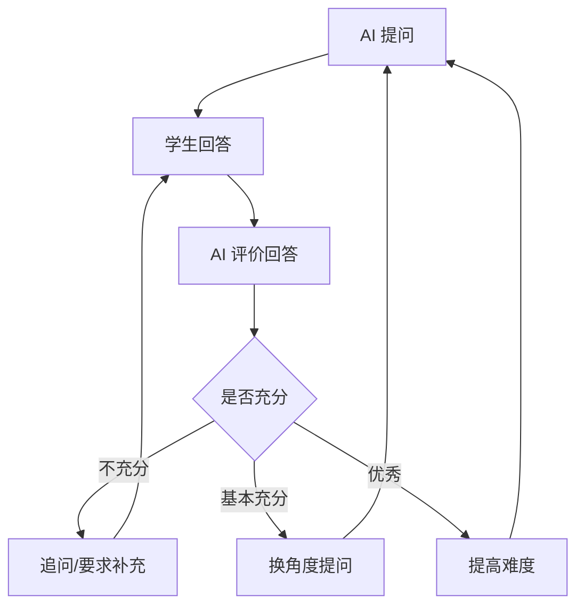

# BioMentor Agent 累积修改清单与后续讨论队列

> 创建时间：2026-05-29  
> 状态：讨论中，暂不进入开发  
> 用途：记录当前已暴露问题、初步判断、后续需要继续讨论的开发任务。等所有任务讨论完成后，再统一进入实现、测试、提交和部署。

## 一、真实 AI 接入与对话质量

### 当前问题

- 工具箱右侧 AI 很可能没有真正调用 DeepSeek，或 DeepSeek 调用失败后被本地 fallback 掩盖。
- 用户追问时，回答仍像初始讲解模板，不针对问题本身回答。
- 示例：用户问“胃蛋白酶的活性 pH 是多少”，合理回答应直接说明胃蛋白酶最适 pH 大约在 1.5-2.5、强酸环境活性最高；当前却重复“围绕胃蛋白酶 Pepsin A，可以先按事实识别...”。
- 知识图谱右侧 AI 也有类似问题：节点自动讲解、模式切换和用户追问没有清晰分层。
- 前端没有区分“真实 AI 回答”和“本地兜底回答”，导致用户以为 AI 已真实接入。

### 初步根因假设

- Vercel 环境变量可能缺少 `DEEPSEEK_API_KEY`。
- `DEEPSEEK_MODEL`、`DEEPSEEK_BASE_URL` 或请求格式可能与 DeepSeek 当前接口不匹配。
- 后端捕获错误后直接返回 200 fallback，前端无法感知真实 AI 调用失败。
- 工具 AI 的 request/context/history 数据流可能没有把用户问题作为最高优先级。
- fallback 文案过像 AI 正常回答，但实际不能处理用户追问。

### 后续目标

- 明确验证 DeepSeek 是否真实调用成功。
- 后端返回结构中区分 `source: "deepseek" | "local_fallback"`，但前端不暴露开发者术语。
- 用户追问必须优先回答问题，再补充工具上下文。
- 初始讲解、快捷问题、自由追问必须走不同 prompt 分支。
- fallback 只能作为温和兜底，不能伪装成真实 AI，也不能答非所问。

## 二、工具箱蛋白结构工具

### 当前问题

- “胃蛋白酶”已能搜到，但需要确认是否真正支持用户输入任意蛋白，而不是只靠少量别名。
- 中文蛋白名、常见英文名、基因名、PDB ID、UniProt ID 都应形成稳定搜索路径。
- 当前 AI 面板可以显示讲解，但追问质量不合格，容易重复初始上下文。

### 后续目标

- 搜索优先级建议：本地精选别名 -> PDB ID -> UniProt ID -> UniProt 关键词搜索 -> 无结果提示。
- 中文蛋白名需要合理映射到英文关键词，或直接通过远程检索获得候选。
- 选中候选后自动加载结构，并同步更新 AI 上下文。
- AI 能回答具体问题，如活性 pH、结构域、功能、活性位点、与实验设计的关系。

## 三、四个工具 AI 面板统一

### 当前问题

- 蛋白、质粒、序列、通路四个工具的 AI 体验应统一，但现在可能只是共享了外壳，真实对话逻辑不足。
- 快捷问题点击后可能没有真正作为用户问题处理。
- 对话历史、当前工具上下文、当前选中对象之间的优先级需要重新梳理。

### 后续目标

- 四个工具共用一套后端 AI 服务层和响应归一化逻辑。
- 每个工具提供自己的结构化上下文摘要。
- 用户追问时，prompt 必须明确：先回答用户问题，再结合工具上下文解释。
- 输入框发送、快捷问题点击、切换候选对象都要有明确状态逻辑。
- loading、失败、兜底状态要自然，但不能暴露 API、key、fallback、debug 等开发信息。

## 四、知识图谱首屏视觉

### 当前问题

- 图谱和左侧文字重叠，节点和线条穿过文案区域。
- 首屏虽然变大了，但整体不高级，像调试网络。
- 节点排布缺少构图感，不应只是把坐标放大。
- 左侧标题、文案、按钮和右侧图谱互相抢视觉重心。
- 中心点位置和节点层级不够精致，缺少产品级主视觉秩序。

### 后续目标

- 左侧文字区设置明确安全范围，图谱不得侵入。
- 右侧图谱作为独立主视觉区域，形成完整知识星系。
- 12 个学科按生物领域分组布局，而不是平均散点。
- 默认画面克制、干净、高级；hover 或点击后再显示关系细节。
- 宽屏、普通桌面、移动端都要重新检查布局。

## 五、知识图谱线条与图形语言

### 当前问题

- 虚线太多，像流程图草稿或调试状态。
- 直线太硬，横穿页面后割裂画面。
- 粗蓝色实线过于突兀，像选中态但常驻。
- 主关系、弱关系、当前选中关系没有清晰视觉层级。
- 背景点阵、玻璃节点、渐变背景、连线叠加后信息噪声过高。

### 后续目标

- 默认不展示所有关系线，只保留少量低透明主关系。
- 连线改成柔和曲线、弧线或光轨，避免硬直线切割页面。
- hover 某个节点时，只高亮它的相关节点和相关线。
- 选中节点时，相关路径增强，其他节点和线条轻微退后。
- 图谱整体语言保持浅色液态玻璃，不做暗黑赛博。

## 六、知识图谱三栏工作台与交互逻辑

### 当前问题

- 点击进入三栏的动画和空间关系仍需进一步产品化。
- 中间图谱展开后容易显得工具化，不够高级。
- 右侧 AI 仍可能重复模板，没有真正围绕当前节点和用户问题回答。
- 知识图谱页面当前有一定卡顿，优先级不高，但如果优化成本低，可以在重做视觉时顺手处理。

### 后续目标

- 默认首屏：展示 12 个学科的高级全局网络。
- hover 学科：相关节点和曲线轻微亮起，其他内容退后。
- 点击学科：平滑过渡到三栏知识工作台。
- 三栏中间节点渐进展开，不能一次性堆满。
- 右侧 AI 根据当前学科、维度、节点、用户问题生成回答。
- 三栏整体也要保持液态玻璃高级感，不只是卡片堆叠。
- 尽量降低首屏渲染压力：减少常驻 SVG 线条、减少大面积 blur 叠层、避免不必要的 GSAP/ScrollTrigger 重复初始化。

### 性能优化备注

- 该项不是最高优先级，不应为了性能牺牲核心视觉方案。
- 如果后续重做图谱首屏，建议顺手做轻量优化：
  - 默认减少线条数量，只在 hover/选中时显示关联线。
  - 减少大面积 `backdrop-blur`、超大 `blur-3xl` 和多层透明背景叠加。
  - 避免全屏 SVG 中大量元素持续重绘。
  - 对节点 hover 动画使用 transform/opacity，避免触发布局抖动。
  - 检查 GSAP/ScrollTrigger 是否重复注册或刷新过多。

## 七、视觉方向共识

- 浅色为主。
- 液态玻璃风格。
- 干净、高级、产品化。
- 右侧知识星系主视觉。
- 少线条、轻线条、曲线光轨。
- hover/点击后再展开关系。
- 不做暗黑赛博。
- 不做普通流程图。
- 不把所有节点和所有关系一次性摊开。

## 八、后续讨论队列

后面继续讨论时，建议按以下顺序补充清单：

1. 首页和整体前端视觉是否还要继续优化。
2. 知识图谱三栏工作台具体如何高级化。
3. 工具箱四个工具除了 AI 外，还有没有功能层面的缺口。
4. 思维导图模块到底作为独立模块，还是知识图谱里的一个视图。
5. 是否需要统一后端 AI 服务层，避免多个 API route 各自处理 DeepSeek。
6. 最终整理完整开发计划后，再统一实现、测试、commit、push、部署。

## 九、模拟学术答辩模块设计草案

### 模块定位

- 模块重点选择科研开题 / 论文答辩方向，而不是普通课程问答。
- 目标是训练学生表达科研问题、研究背景、实验设计、结果解释、局限性、创新点和应用价值。
- `/seminar` 不应继续停留在静态演示卡片，而应升级为可真实互动的 AI 答辩训练器。

### 核心对象：Defense Brief 答辩资料包

- 不管来源是站内模块还是外部文件，都先由 AI 凝练成标准化 `Defense Brief`。
- 答辩 AI 后续只围绕用户确认后的资料包提问、追问和评分。
- 用户进入答辩前必须能编辑 AI 生成的资料包，避免 AI 理解偏差带歪整场答辩。

### 支持的导入来源

- 站内模块导入：
  - 知识图谱节点：围绕知识点/前沿节点答辩。
  - 科研实战任务：围绕开题、实验设计、研究方案答辩。
  - 产业案例：围绕技术转化、产业应用、风险控制答辩。
  - 蛋白工具：围绕蛋白结构、功能、机制答辩。
  - 序列工具：围绕序列分析、突变、ORF、引物设计答辩。
  - 质粒工具：围绕载体设计、元件功能、表达策略答辩。
  - 通路工具：围绕机制链路、上下游调控、干预策略答辩。
- 用户外部导入：
  - 手动输入主题。
  - 粘贴论文摘要、实验方案、课程作业要求。
  - 上传 PDF。
  - 上传 DOCX。
  - 上传 PPT/PPTX。
  - 后续可补 Markdown/TXT。

### 文件导入策略

- 第一版支持 PDF/DOCX/PPT/PPTX 的文本提取与 AI 结构化理解。
- 不做复杂版式还原，重点提取标题、摘要、段落、表格文本、PPT bullet 和备注等可用于答辩的内容。
- 第一版不长期保存原始文件。
- 上传文件后后端临时读取、提取文本、生成资料包；长期只保存或缓存 `Defense Brief`、答辩过程和评分报告。
- 扫描版 PDF / 图片型 PDF 暂不作为主线，可提示后续支持 OCR。

### 答辩前流程

1. 用户从模块导入、上传文件、粘贴文本或手动输入主题。
2. AI 识别资料类型和内容结构。
3. AI 生成 2-3 个候选答辩主题。
4. 用户选择或编辑一个主题。
5. AI 生成 `Defense Brief`。
6. 用户编辑并确认标题、背景、核心问题、假设、方法、证据、局限性、关键词。
7. 系统生成答辩委员会并进入答辩室。

### 范围控制

- 不增加单独的“答辩准备阶段”。
- 用户确认 `Defense Brief` 后直接开始答辩。
- 该模块只是 BioMentor 六大模块之一，不做成过重的独立答辩平台。
- 第一版重点是：导入资料 -> 凝练资料包 -> 多角色追问 -> 闭环报告。
- 不额外加入“正式答辩前准备建议、模拟备考清单、预训练提示”等扩展流程。

### Defense Brief 第一版字段

```ts
interface DefenseBrief {
  id: string;
  title: string;
  mode: "proposal" | "paper_defense";
  sourceType:
    | "manual"
    | "file"
    | "knowledge_map"
    | "research"
    | "case"
    | "tool";

  sourceSummary: string;
  sourceRefs: {
    type: string;
    label: string;
    href?: string;
  }[];

  background: string;
  researchQuestion: string;
  hypothesis: string;
  objectives: string[];
  methods: string[];
  evidence: string[];
  limitations: string[];
  innovationPoints: string[];
  applicationValue: string;

  keywords: string[];
  relatedKnowledgeNodes: string[];
  relatedTools: {
    label: string;
    href: string;
    reason: string;
  }[];

  createdAt: string;
  updatedAt: string;
}
```

### 答辩模式

- 第一版重点支持：
  - 开题答辩：研究背景、科学问题、假设、技术路线、可行性、风险。
  - 论文答辩：结果解释、证据链、创新点、局限性、替代解释。
- 预留扩展：
  - 学术会议 Q&A。
  - 产业转化答辩。

### 答辩委员会

- 默认 4 类评委角色：
  - 机制评委：概念准确性、机制链条、因果解释。
  - 方法评委：实验设计、变量、对照、样本量、验证方法。
  - 证据评委：数据来源、文献依据、结果可信度、替代解释。
  - 应用评委：转化价值、应用边界、安全风险、产业落地难点。

### 答辩轮数与难度

- 轮数可选：3 / 5 / 8 轮。
- 难度可选：基础 / 标准 / 挑战。
- 默认：5 轮，标准难度。
- 基础难度：问题更清楚，追问较少，反馈更教学化。
- 标准难度：接近课程开题答辩，要求解释机制和方法。
- 挑战难度：评委更尖锐，会追问局限、替代解释和实验漏洞。
- 提问风格与难度绑定：
  - 基础 = 温和导师型：更多引导和提示，适合初学者。
  - 标准 = 标准答辩型：正常追问，有压力但不刁难。
  - 挑战 = 严格评审型：抓漏洞、质疑方法、追问证据和替代解释。

### 答辩过程状态机



### 答辩过程反馈策略

- 选择 B：答辩过程中只显示评委追问，不显示详细评分与缺失点。
- 目标是更接近真实开题/论文答辩现场，保持沉浸感和压力感。
- 每轮内部仍然保存 AI 对回答的结构化评价、分数、缺失点和 expected points。
- 这些过程评价不在答辩中打断用户，而是在最终闭环报告中统一展示。
- 如用户回答明显偏题，评委可以通过追问体现问题，但不直接弹出“你错了/扣分”。

### 页面结构建议

- 顶部：答辩训练中心，展示模式、主题、来源、难度。
- 左栏：资料包与答辩进度，展示背景、核心问题、技术路线、关键词、来源。
- 中间：答辩室，展示当前评委、当前问题、用户回答输入区、历史记录。
- 右栏：实时诊断，展示当前考察能力、薄弱点、覆盖维度、下一步可能追问方向。
- 结束页：答辩报告，展示总分、雷达图、分项反馈、知识盲区、推荐学习路径。

### 暂定报告维度

- 概念准确性。
- 机制推理能力。
- 科研设计能力。
- 证据使用能力。
- 表达逻辑。
- 面对质疑的应答能力。

### 闭环报告要求

- 答辩报告选择闭环报告，不做轻量总结。
- 报告需要基于完整答辩记录，而不是只看最后一轮。
- 报告内容包括：
  - 总分、模式、主题、难度、轮数、整体评价。
  - 六维评分。
  - 机制评委、方法评委、证据评委、应用评委的分项反馈。
  - 知识盲区诊断：严重程度、出现轮次、影响原因、补救建议。
  - 联动推荐：知识图谱节点、工具箱任务、科研实战任务、产业案例。
  - 下一轮答辩主题。
- 每条推荐需要包含模块类型、标题、跳转链接、推荐理由和建议完成动作。

### 暂定范围

- 第一版做文字答辩，不做语音。
- 第一版可用 localStorage 保存当前资料包、答辩会话和报告；后续再接数据库。
- 后端负责 AI 生成和文件文本提取，不长期保存原文件。
- 不做答辩准备阶段，避免模块过重。

## 十、暂定验收标准

- 工具箱和知识图谱的 AI 追问能直接回答用户问题，不重复初始模板。
- DeepSeek 真实调用状态可被开发侧验证，用户侧不看到技术细节。
- 知识图谱首屏节点不压文字，线条不穿过核心文案。
- 默认图谱视觉干净，hover/点击后关系才增强。
- 知识图谱整体观感接近产品级主视觉，而不是调试网络。
- 四个工具 AI 行为一致，输入、快捷问题、loading、失败状态都可预测。
- 知识图谱交互不明显卡顿；如果仍有轻微卡顿，不影响核心学习流程。
- 学术答辩模块能从多来源生成 Defense Brief，并完成多角色、多轮追问和结构化报告。

## 十一、统一开发任务清单（待讨论完成后执行）

> 执行原则：本清单中的任务先继续讨论确认，确认完成后一次性进入开发。开发时需要先修真实 AI 链路，再做视觉与交互重构，最后接入答辩模块。所有任务完成后统一测试、commit、push、部署。

### 任务 1：修复真实 AI 接入与追问逻辑

#### 目标

- 工具箱和知识图谱右侧 AI 必须真正尝试调用 DeepSeek。
- 用户追问必须直接回答问题，不能重复初始讲解模板。
- fallback 只能作为真实 AI 失败后的温和兜底，不能伪装成真实 AI。

#### 具体开发内容

1. 检查并统一 DeepSeek 调用配置：
   - 读取 `DEEPSEEK_API_KEY`。
   - 读取 `DEEPSEEK_MODEL`，默认 `deepseek-v4-flash`。
   - 如有需要读取 `DEEPSEEK_BASE_URL`，默认 DeepSeek 官方兼容接口地址。
   - 不把 API key 写入代码、日志、前端或提交记录。
2. 后端 AI 响应结构增加开发侧可识别字段：
   - `source: "deepseek" | "local_fallback"`。
   - `ok: boolean`。
   - 可选 `reason` 仅用于内部调试，不在前端普通 UI 展示。
3. 工具箱 AI prompt 分成两类：
   - 初始讲解：围绕当前工具上下文生成结构化学习解释。
   - 用户追问：优先回答用户问题，再结合当前工具上下文补充。
4. 知识图谱 AI prompt 分成两类：
   - 节点自动讲解：解释当前节点与路径。
   - 用户追问：回答用户针对该节点/学科/维度的问题。
5. 修复快捷问题逻辑：
   - 快捷问题点击后必须作为用户问题进入对话。
   - 不应重新触发初始讲解。
6. 修复对话历史：
   - 发送追问时带最近若干轮历史。
   - 历史中必须包含用户原问题和 AI 回答。
   - 不把空回答、fallback 模板误当成主要上下文。
7. fallback 策略：
   - 如果没有 key 或 API 失败，返回基于当前上下文的简短兜底。
   - fallback 需要尽量回答问题，但必须避免编造具体实验/医学结论。
   - 前端不显示“API/fallback/key”等开发词。
8. 增加测试：
   - 模拟 DeepSeek 成功返回时，`source` 应为 `deepseek`。
   - 模拟 DeepSeek 失败时，`source` 应为 `local_fallback`。
   - 用户问“胃蛋白酶的活性 pH 是多少”时，返回内容不能是初始讲解模板。
   - 快捷问题发送后不重复第一条初始回答。

#### 验收标准

- 工具箱任意工具中，用户追问能直接回答问题。
- 知识图谱右侧 AI 用户追问不重复节点初始讲解。
- 开发侧能判断当前回答来自 DeepSeek 还是本地兜底。
- 用户侧看不到 API、fallback、debug、环境变量等词。
- Vercel 环境变量未配置时系统可用但不会假装真实 AI 成功。

#### 注意事项

- 这项是最高优先级。
- 不先解决这个问题，不继续扩展更多 AI 功能。
- 不泄露用户提供过的真实 key。

### 任务 2：统一四个工具箱 AI 面板

#### 目标

- 蛋白、质粒、序列、通路四个工具的 AI 对话体验一致。
- 每个工具保留自己的专业上下文，但共用一套清晰的 AI 数据流。

#### 具体开发内容

1. 梳理 `BioMentorToolChat` 组件：
   - 初始讲解、用户追问、快捷问题三种行为分开。
   - 切换工具上下文时自动生成新的初始讲解。
   - 用户已经追问后，不因为组件刷新丢失当前对话。
2. 统一工具上下文结构：
   - `title`：当前对象名称。
   - `subtitle`：补充描述。
   - `facts`：结构化事实。
   - `highlights`：教学重点。
   - `warnings`：注意事项。
   - `sourceRefs`：来源链接或模块来源。
3. 工具-specific 上下文要求：
   - 蛋白：名称、物种、UniProt、PDB、结构来源、是否预测结构、教学重点。
   - 质粒：载体名、长度、宿主、功能元件、启动子、抗性、复制起点。
   - 序列：序列类型、长度、GC 含量、ORF、酶切位点、翻译结果。
   - 通路：通路名、节点、边、上下游关系、关键机制、当前选中节点/边。
4. 前端 UI 统一：
   - AI 面板标题、助手角色、消息样式、快捷问题样式一致。
   - loading 状态一致。
   - 失败/兜底状态一致。
   - 不显示“无法生成智能讲解”这种死状态。
5. 增加四个工具的最小 smoke 测试或浏览器验证：
   - 选择/输入一个对象。
   - AI 初始讲解出现。
   - 输入追问后追加新回答。
   - 快捷问题点击后追加新回答。

#### 验收标准

- 四个工具的 AI 面板行为一致。
- 工具 AI 能围绕具体工具结果回答问题。
- 追问不会重复初始模板。
- 工具切换上下文后，AI 能更新对象。

### 任务 3：增强蛋白结构搜索能力

#### 目标

- 蛋白结构工具支持用户输入更多真实蛋白，而不是只支持演示样例。
- 中文名、英文名、基因名、PDB ID、UniProt ID 都能尽量找到候选。

#### 具体开发内容

1. 搜索优先级：
   - 本地精选别名。
   - PDB ID。
   - UniProt ID。
   - UniProt 关键词搜索。
   - 无结果提示。
2. 中文蛋白名处理：
   - 保留少量常用中文别名映射。
   - 对未知中文输入尝试作为关键词进入远程检索。
   - 不要未知输入时退回 GFP/Cas9/血红蛋白演示。
3. 远程候选映射：
   - UniProt entry 映射成统一 `ProteinCandidate`。
   - 有 PDB 交叉引用时优先实验结构。
   - 无 PDB 但有 UniProt accession 时尝试 AlphaFold 预测结构。
4. 结构加载：
   - 搜索后默认选中第一个候选。
   - 候选有结构 URL 时自动加载 3D 结构。
   - 无结构时显示清晰说明，不要空白。
5. AI 联动：
   - 选中候选后更新 AI 上下文。
   - 用户可围绕该蛋白进入答辩模块。

#### 验收标准

- 搜索“胃蛋白酶”能返回 Pepsin A / P00790 / 1PSO。
- 搜索 PDB ID 能返回对应结构。
- 搜索 UniProt ID 能返回候选。
- 搜索未知词不会回到演示样例。
- 选中候选后 AI 上下文正确更新。

### 任务 4：重做知识图谱首屏视觉

#### 目标

- 让知识图谱首屏成为高级主视觉，而不是调试网络。
- 解决图谱和文字重叠、线条噪声大、节点排布无构图的问题。

#### 具体开发内容

1. 首屏布局重构：
   - 左侧固定文字安全区。
   - 右侧固定图谱主视觉区。
   - 图谱不得压住标题、文案和按钮。
2. 节点布局重构：
   - 12 个学科按领域分组。
   - 核心基础、生命系统、结构与数据、工程交叉形成不同团簇。
   - 不再简单使用现有 x/y 坐标放大。
3. 中心节点重构：
   - BioMentor Knowledge Core 作为视觉中心，但不抢主标题。
   - 中心节点与学科节点形成清晰层级。
4. 线条重构：
   - 默认不显示所有线。
   - 默认只显示少量低透明曲线或光轨。
   - 不使用大量虚线。
   - 不使用硬直线横穿页面。
   - hover/选中时再显示相关关系。
5. 图形语言：
   - 浅色液态玻璃。
   - 少线条、轻线条、曲线光轨。
   - 节点有玻璃质感但不过度 blur。
   - 背景噪声减少。
6. 交互状态：
   - 默认态：干净、克制。
   - hover 态：当前节点与相关节点亮起，其他节点轻微退后。
   - 点击态：平滑进入三栏工作台。
7. 响应式：
   - 宽屏不散。
   - 普通桌面不挤。
   - 移动端改为上下结构或简化图谱。

#### 验收标准

- 首屏任意节点和连线不压住左侧文字。
- 默认态没有满屏虚线。
- 图谱视觉明显比当前更高级、更有秩序。
- hover/点击关系清晰。
- 页面无明显卡顿。

### 任务 5：优化知识图谱性能

#### 目标

- 在不牺牲视觉质量的前提下，降低知识图谱页面卡顿。
- 这项是低优先级，重做视觉时顺手处理。

#### 具体开发内容

1. 减少默认 SVG 元素数量：
   - 默认不渲染全部关系线。
   - hover/选中时再渲染或显示相关线。
2. 减少昂贵视觉效果：
   - 减少大面积 `backdrop-blur`。
   - 减少超大 `blur-3xl` 叠层。
   - 避免多个全屏半透明层重叠。
3. 动画优化：
   - hover 动画只使用 transform/opacity。
   - 避免触发布局重排。
   - 检查 GSAP/ScrollTrigger 是否重复注册、重复 refresh。
4. 图谱渲染优化：
   - 静态节点位置用常量。
   - 避免每次 render 重建大量对象。
   - 对不变数据使用 memo。

#### 验收标准

- 知识图谱页面滚动、hover、点击不明显卡顿。
- 如果仍有轻微卡顿，不影响核心学习流程。
- 不为了性能牺牲核心视觉设计。

### 任务 6：优化知识图谱三栏工作台

#### 目标

- 三栏工作台继续保留，但视觉和交互要比现在更产品化。
- 右侧 AI 必须和真实 AI 修复后的逻辑一致。

#### 具体开发内容

1. 左栏：
   - 学科导航清晰。
   - 当前学科、重点学科状态明确。
   - 搜索框不喧宾夺主。
2. 中栏：
   - 学科中心、六维节点、子节点层级清楚。
   - 点击维度后渐进展开子节点。
   - 不一次性堆满所有内容。
   - 节点和线条风格与首屏统一。
3. 右栏：
   - 当前节点信息清楚。
   - 教学导师/科研助手模式保留。
   - 用户追问真实回答。
   - 模块联动按钮保留，但不要堆得太乱。
4. 进入动画：
   - 从首屏点击学科后平滑进入工作台。
   - 不白屏。
   - 不突然跳动。

#### 验收标准

- 点击任意学科能进入工作台。
- 工作台三栏均可见且不空白。
- 节点展开过程清晰。
- 右侧 AI 可以围绕当前节点回答追问。

### 任务 7：开发模拟学术答辩模块

#### 目标

- 将 `/seminar` 从静态演示页升级为科研开题 / 论文答辩训练器。
- 保持模块范围适中，不做过重的独立答辩平台。

#### 第一版范围

- 文字答辩，不做语音。
- 不做单独答辩准备阶段。
- 用户确认 `Defense Brief` 后直接开始答辩。
- 不长期保存原始文件。
- 使用 localStorage 保存当前资料包、答辩会话和报告。
- 后端负责文件文本提取和 AI 生成。

#### 核心流程

1. 导入资料：
   - 手动输入主题。
   - 粘贴文本。
   - 上传 PDF。
   - 上传 DOCX。
   - 上传 PPT/PPTX。
   - 从站内模块导入。
2. AI 生成候选主题：
   - 生成 2-3 个候选答辩主题。
   - 用户选择或编辑一个。
3. AI 生成 `Defense Brief`：
   - 标题。
   - 背景。
   - 核心研究问题。
   - 假设。
   - 目标。
   - 方法。
   - 证据。
   - 局限性。
   - 创新点。
   - 应用价值。
   - 关键词。
   - 关联模块。
4. 用户确认/编辑资料包。
5. 开始答辩：
   - 系统生成评委。
   - 多角色轮流提问。
   - 用户逐轮回答。
   - 过程只显示追问，不显示评分。
6. 生成闭环报告：
   - 总分。
   - 六维评分。
   - 评委反馈。
   - 知识盲区。
   - 模块联动推荐。
   - 下一轮答辩主题。

#### 支持导入来源

- 知识图谱节点：围绕知识点/前沿节点答辩。
- 科研实战任务：围绕开题、实验设计、研究方案答辩。
- 产业案例：围绕技术转化、产业应用、风险控制答辩。
- 蛋白工具：围绕蛋白结构、功能、机制答辩。
- 序列工具：围绕序列分析、突变、ORF、引物设计答辩。
- 质粒工具：围绕载体设计、元件功能、表达策略答辩。
- 通路工具：围绕机制链路、上下游调控、干预策略答辩。

#### 文件处理要求

- PDF：提取文本内容、标题、段落、可能的摘要和图表说明。
- DOCX：提取标题、段落、表格文本。
- PPT/PPTX：提取每页标题、正文 bullet、备注文本（如果可行）。
- 第一版不做复杂版式还原。
- 第一版不做 OCR。
- 扫描版 PDF 可提示暂不支持或提取结果为空。
- 单文件大小需要限制，建议 10-20MB。

#### 答辩模式

- 开题答辩：
  - 关注研究背景、科学问题、假设、技术路线、可行性、风险。
- 论文答辩：
  - 关注结果解释、证据链、创新点、局限性、替代解释。

#### 评委角色

- 机制评委：
  - 问概念准确性、机制链条、因果解释。
- 方法评委：
  - 问实验设计、变量、对照、样本量、验证方法。
- 证据评委：
  - 问数据来源、文献依据、结果可信度、替代解释。
- 应用评委：
  - 问转化价值、应用边界、安全风险、产业落地难点。

#### 轮数与难度

- 轮数：3 / 5 / 8。
- 难度：基础 / 标准 / 挑战。
- 默认：5 轮，标准难度。
- 基础 = 温和导师型：
  - 问题更清楚。
  - 追问较少。
  - 更偏引导。
- 标准 = 标准答辩型：
  - 正常追问。
  - 有压力但不刁难。
  - 接近课程开题答辩。
- 挑战 = 严格评审型：
  - 抓漏洞。
  - 质疑方法。
  - 追问证据、替代解释和实验漏洞。

#### 答辩过程反馈策略

- 采用 B：过程中只显示评委追问，不显示详细评分和缺失点。
- 每轮内部仍保存：
  - 问题。
  - 用户回答。
  - 评委角色。
  - 考察意图。
  - expectedPoints。
  - score。
  - strengths。
  - missingPoints。
  - followUpQuestion。
  - nextAction。
- 这些评价只在最终报告中统一展示。

#### 闭环报告要求

- 总览：
  - 总分。
  - 模式。
  - 主题。
  - 难度。
  - 轮数。
  - 整体评价。
- 六维评分：
  - 概念准确性。
  - 机制推理能力。
  - 科研设计能力。
  - 证据使用能力。
  - 表达逻辑。
  - 面对质疑的应答能力。
- 评委分项反馈：
  - 分数。
  - 优点。
  - 缺失点。
  - 代表性追问。
  - 改进建议。
- 知识盲区：
  - 标签。
  - 严重程度。
  - 出现轮次。
  - 影响原因。
  - 补救建议。
- 联动推荐：
  - 知识图谱节点。
  - 工具箱任务。
  - 科研实战任务。
  - 产业案例。
  - 每条推荐包含标题、链接、理由、建议动作。
- 下一轮答辩主题：
  - 2-3 个主题。
  - 每个主题包含 focus 和 reason。

#### 页面结构

- 导入页/导入区域：
  - 手动输入。
  - 粘贴文本。
  - 文件上传。
  - 站内导入提示。
- 主题选择区：
  - 展示 AI 生成的候选主题。
  - 用户选择或编辑。
- 资料包确认页：
  - 可编辑 Defense Brief。
  - 确认后进入答辩。
- 答辩室：
  - 当前评委。
  - 当前问题。
  - 用户回答输入框。
  - 历史问答。
  - 当前轮数和进度。
- 报告页：
  - 总览。
  - 六维评分。
  - 评委反馈。
  - 知识盲区。
  - 联动推荐。
  - 下一轮主题。

#### 验收标准

- 用户可通过手动输入/粘贴/文件上传生成资料包。
- 用户可编辑资料包。
- 用户可完成至少 3 轮答辩。
- 评委能围绕资料包追问，而不是泛泛聊天。
- 答辩过程中不显示详细评分。
- 结束后生成闭环报告。
- 报告能推荐到其他模块。

### 任务 8：站内模块接入答辩入口

#### 目标

- 让答辩模块与其他模块形成联动，而不是孤立页面。

#### 具体开发内容

1. 知识图谱：
   - 节点详情或右侧 AI 面板增加“围绕该节点答辩”入口。
   - 传入学科、维度、节点摘要、关键点。
2. 科研实战：
   - 当前科研任务增加“进入开题答辩”入口。
   - 传入案例背景、任务目标、实验设计内容。
3. 产业案例：
   - 案例详情增加“产业转化答辩”入口。
   - 传入案例背景、科研基础、应用场景、产业价值。
4. 工具箱：
   - 蛋白工具：围绕当前蛋白答辩。
   - 质粒工具：围绕当前载体设计答辩。
   - 序列工具：围绕当前序列分析答辩。
   - 通路工具：围绕当前通路机制答辩。
5. 技术实现建议：
   - 不把大段数据塞进 URL。
   - 使用本地创建 `DefenseBriefDraft` 或调用 brief create API。
   - 跳转 `/seminar?briefId=xxx` 或用 localStorage 暂存 draft。

#### 验收标准

- 至少知识图谱、科研实战、产业案例、蛋白工具能进入答辩。
- 从来源模块进入后，答辩资料包能带上来源信息。
- 报告中的推荐能返回对应模块。

### 任务 9：整理最终测试与部署流程

#### 目标

- 所有讨论完成并开发后，统一测试、提交、推送、部署。

#### 必跑验证

- `node --test frontend/lib/*.test.mjs`
- `npm run build`
- 浏览器验证：
  - `/tools/protein`
  - `/tools/plasmid`
  - `/tools/sequence`
  - `/tools/pathway`
  - `/knowledge-map`
  - `/seminar`
- 公网验证：
  - 首页 200。
  - 知识图谱 200。
  - 四个工具页 200。
  - 学术研讨页 200。
  - 关键 API 200。

#### Git 与部署

- 不强推 master。
- 不覆盖协作者分支。
- 正常 commit。
- push 到 GitHub。
- 触发 Vercel 生产部署。
- 验证原公网地址已更新。

## 线上 Bug 记录队列（待统一修复）

### Bug 1：答辩中点击“提前生成报告”后页面白屏

#### 现象

- 用户从知识图谱等站内入口进入学术答辩页后，可以正常进入答辩阶段。
- 在答辩阶段，界面显示“答辩委员会正在生成下一问 / 正在等待评委追问”时，点击右上角“提前生成报告”会触发页面崩溃。
- 崩溃后页面只显示：
  - `Application error: a client-side exception has occurred (see the browser console for more information).`
- 涉及页面地址示例：
  - `/seminar?source=知识图谱&topic=遗传学与基因组学知识图谱答辩&summary=研究遗传变异、基因组结构、遗传规律和群体差异...`

#### 初步影响范围

- 影响 `/seminar` 答辩阶段的“提前生成报告”按钮。
- 可能与当前正在请求下一问、`currentQuestion` 尚未生成、`transcript` 状态不完整、`report` 数据为空或异步状态竞争有关。
- 可能影响所有来源进入答辩后的提前报告功能，不限于知识图谱。

#### 待排查方向

- 浏览器 console 的具体异常堆栈。
- 点击“提前生成报告”时 `isLoading`、`currentQuestion`、`transcript`、`brief`、`report` 的状态。
- `finishReport()` 是否允许在下一问还没生成、transcript 仅有 committee 消息或为空时执行。
- 报告 API 返回失败/空数据时，前端是否仍进入 `report` stage 并读取未定义字段。
- “提前生成报告”按钮在 `isLoading` 时是否应该禁用，或点击时先取消/等待当前问题生成。

#### 验收标准

- 答辩阶段点击“提前生成报告”不再白屏。
- 如果当前正在生成下一问，按钮应禁用或提示等待。
- 如果已有 transcript 较少，也能生成合理的阶段性报告，或给出不崩溃的提示。
- 浏览器 console 不再出现客户端异常。

### Bug 2：蛋白结构搜索对英文蛋白名/片段误判为 UniProt ID

#### 用户反馈

- 工具箱中输入部分蛋白搜索不出来。
- 使用者感觉“好像只能输中文”才比较稳定。

#### 已核实证据

- 线上接口 `/api/bio-tools/protein/search` 实测：
  - `胃蛋白酶`、`胃蛋` 可以命中内置胃蛋白酶候选。
  - `pepsin` 返回的是 `UniProt PEPSIN`，不是实际的 Pepsin A / `P00790`。
  - `insulin` 返回的是 `UniProt INSULIN`，不是实际胰岛素 / `P01308`。
  - `amylase`、`lysozyme`、`actin`、`tubulin`、`BRCA1` 等常见英文蛋白名也会被当作“假 UniProt ID”。
  - 对应 AlphaFold URL 如 `AF-PEPSIN-F1-model_v4.pdb`、`AF-INSULIN-F1-model_v4.pdb` 返回 404，导致结构查看失败。

#### 根因定位

- `frontend/lib/biotools.mjs` 中 `searchProteinCandidates(query)` 在本地别名/远程关键词搜索之前，先用宽泛正则 `/^[A-Za-z][A-Za-z0-9]{4,9}$/` 把 5-10 位英文数字串直接当成 UniProt accession。
- 这会错误吞掉大量真实英文关键词，例如 `pepsin`、`insulin`、`amylase`、`BRCA1`。
- API route 的正式 UniProt accession 正则相对严格，但 fallback/local candidate 的宽泛判断更早返回了假候选，阻断后续正确搜索。

#### 待修复方向

- 只把符合真实 UniProt accession 规则的字符串当作 accession。
- 英文蛋白名、基因名、部分关键词应先走：
  - 内置 curated alias / fuzzy alias。
  - UniProt keyword search。
  - 必要时再给 metadata-only 候选，而不是制造不可用结构 URL。
- 对无结构候选明确显示“暂无可直接显示结构”，不要给 404 的 AlphaFold 文件。
- 搜索结果候选需要展示来源可信度：内置精选、UniProt reviewed、实验结构、预测结构、仅元数据。

#### 验收标准

- `pepsin` 命中 Pepsin A / `P00790`，优先显示 PDB `1PSO`。
- `insulin` 命中 Human insulin / `P01308`，优先显示真实可用结构。
- `amylase`、`lysozyme`、`actin` 等英文关键词不再生成 `UniProt AMYLASE` 这类假 accession。
- 无直接结构时页面不报错、不白屏，给出可理解提示。

### Bug 3：通路搜索对内置通路以外的常见关键词结果为空

#### 用户反馈

- 通路工具也存在“输入部分内容搜索不出来”的情况。

#### 已核实证据

- 线上接口 `/api/bio-tools/pathway/search` 实测：
  - 内置教学通路的中英全称和片段基本可用：`凋亡`、`凋`、`apoptosis`、`apop`、`MAPK`、`map`、`糖酵解`、`glyco` 均能返回本地候选。
  - 超出内置五个教学通路的常见关键词返回 0：`PI3K`、`wnt`、`notch`、`TCA`。

#### 根因定位

- 当前本地 alias 只覆盖五类教学图谱：细胞周期、细胞凋亡、MAPK、糖酵解、DNA 修复。
- Reactome 远程搜索没有足够的 query 扩展、fallback 或用户提示，因此常见通路词可能直接空结果。
- 用户预期是“自己输入想看的通路也能显示”，而当前能力更接近“内置教学通路 + 有时可远程搜到”。

#### 待修复方向

- 增加常见通路 alias 和 query 扩展：PI3K-AKT、Wnt、Notch、TCA/Citric acid cycle、mTOR、JAK-STAT、TGF-beta、NF-kB 等。
- 对 Reactome 查询结果做更稳健的字段兼容和去重。
- 空结果时给出建议搜索词和“可尝试英文全称/同义词”的提示。
- 如果远程只返回元数据，先展示候选列表和摘要，不强行进入内置图谱渲染。

#### 验收标准

- `PI3K`、`Wnt`、`Notch`、`TCA` 至少返回可解释候选或明确的无结构/无图谱提示。
- 内置五个教学通路保持现有可视化效果。
- 空结果时页面不让用户误以为搜索坏了。

### Bug 4：质粒图谱上传格式与注释要求不够清楚

#### 用户反馈

- 质粒图谱是不是只能上传特定格式？
- 是不是必须有明确注释才行？

#### 已核实证据

- 页面文件选择器当前只接受：`.gb`、`.gbk`、`.genbank`、`.txt`、`.fasta`、`.fa`。
- 解析逻辑：
  - GenBank：需要包含 `LOCUS` 和 `FEATURES`，并从 `FEATURES` 中读取坐标与 `/label`、`/gene`、`/product`、`/note`。
  - FASTA / 纯 DNA 序列：只能识别整段 uploaded sequence，无法推断 ori、抗性基因、promoter、MCS 等功能元件。
  - 未知文本：当前也会 fallback 成单一 uploaded sequence，且没有明显错误提示。
- 页面虽然有“未注释序列”的提示，但对“哪些格式支持、为什么没元件、如何准备 GenBank 文件”解释不够明确。

#### 根因定位

- 该工具目前是“GenBank 注释图谱查看器 + FASTA/裸序列兜底”，不是完整的自动质粒注释工具。
- 没有接入 pLannotate / SnapGene / ApE / Benchling 等格式解析或自动注释能力。
- 未知格式没有强提示，容易让用户觉得上传成功但功能失效。

#### 待修复方向

- 在上传区明确写清：
  - 推荐上传 GenBank `.gb/.gbk/.genbank`，且需要 `FEATURES` 注释。
  - FASTA / TXT 只显示整段序列长度，不会自动识别元件。
  - 暂不支持 SnapGene `.dna`、ApE 二进制、Benchling 私有格式、图片/PDF。
- 对 unknown 输入显示醒目的“不支持/无法识别格式”提示，而不是静默画一条 uploaded sequence。
- 可增加“下载/查看示例 GenBank 格式”或“粘贴 GenBank 文本”的说明。
- 后续如果要真正自动注释，需要单独接入 pLannotate/BLAST/本地元件库。

#### 验收标准

- 用户上传前能清楚知道支持格式和注释要求。
- 上传 FASTA/裸序列时明确提示“只能显示序列轨道，不能自动识别元件”。
- 上传未知格式时不误导展示为成功图谱。

### Bug 5：四个工具详情页缺少返回工具首页入口

#### 用户反馈

- 每个工具好像没有回到工具首页的返回键。

#### 已核实证据

- 代码检索 `frontend/app/tools/*/page.tsx`：
  - 蛋白、质粒、序列、通路四个工具页 header 中都有“带入答辩”入口。
  - 没有发现 `href="/tools"` 或“返回工具首页/返回工具箱”的入口。

#### 待修复方向

- 四个工具页 header 左上或标题上方统一加入“返回工具箱”按钮。
- 样式保持液态玻璃轻量按钮，不抢主要操作。
- 移动端也要可见，不遮挡标题和搜索区。

#### 验收标准

- `/tools/protein`、`/tools/plasmid`、`/tools/sequence`、`/tools/pathway` 都能一键回到 `/tools`。
- 返回入口位置统一、视觉轻、不影响“带入答辩”按钮。

### Bug 6：知识图谱展开后的子模块节点过于紧凑并出现重叠

#### 用户反馈

- 进入某个学科后，子模块稍微有点紧凑，节点重叠在一起。
- 截图中分子生物学展开后，基础知识的子节点 `DNA`、`RNA`、`蛋白质`、`中心法则` 排布拥挤，部分边线与文字穿插，节点之间缺少呼吸感。

#### 已观察现象

- 中心学科节点、六维模块节点和右侧子节点的距离不够。
- 子节点仍像固定点位硬摆放，没有碰撞避让。
- 边线从节点中心穿过，视觉上会切到文字或按钮。
- 高亮节点和普通节点的尺寸差异会进一步挤压周围节点。

#### 待修复方向

- 展开态图谱需要扩大有效画布和节点半径，减少右侧子节点堆叠。
- 子节点布局改成更明确的扇形/弧线/分层结构，而不是小范围内平铺。
- 给节点之间设置最小距离，避免文本按钮互相压住。
- 边线应从节点边缘附近出发，降低穿过文字的概率。
- 线条颜色和透明度要更高级，减少杂乱感；必要时只高亮当前路径，弱化非当前路径。
- 移除或减少容易干扰的跨区直线，让结构关系更清晰。

#### 验收标准

- 点击任一学科后，六维模块和子节点不重叠。
- `DNA`、`RNA`、`蛋白质`、`中心法则` 这类同组子节点有清楚间距。
- 线条不明显穿过主要文字。
- 视觉上仍保持液态玻璃和高级知识网络感，而不是普通流程图。

### Bug 7：知识图谱首屏主视觉不够沉浸，图谱太靠右且偏小

#### 用户反馈

- 知识图谱首屏还是不好看。
- 期望图谱在中间、做大、沉浸式。
- 左边文字没有必要做这么大。

#### 已观察现象

- 当前首屏视觉重心偏左文案 + 右侧小图谱，整体更像普通 hero 双栏，而不是“沉浸式知识星图”。
- 图谱被压在右侧区域，尺寸不够大，网络关系没有成为第一视觉焦点。
- 左侧标题“生命科学 / 知识星图”过大，抢走图谱的主视觉权重。
- 图谱节点和连线的层次感还不够，中心 BioMentor 与学科网络没有形成足够强的空间纵深。

#### 待修复方向

- 首屏改为“图谱主导”的构图：
  - 图谱放在页面中间或中偏右，但占据主要视觉面积。
  - 左侧文案缩小，变成辅助说明和入口按钮。
  - 图谱不应像被框在一块区域里，而应融入整屏背景。
- 图谱尺寸明显放大，节点分布更疏朗，中心节点和 12 个学科节点形成沉浸式网络。
- 左侧标题降级：
  - 保留“BioMentor 知识星图”标识。
  - 主标题可以更短、更小，不再占据半屏。
  - 文案控制在 1-2 行，不压过图谱。
- 动效方向：
  - 首屏进入时节点轻微浮动、线条渐显、中心节点呼吸。
  - 鼠标悬停某节点时局部高亮，弱化其他连线。
  - 点击进入学科时，从首屏大图谱丝滑放大/聚焦到三栏工作台。

#### 验收标准

- 首屏第一眼看到的是“大而沉浸的知识图谱”，不是大标题。
- 图谱主体位于视觉中心，尺寸足够撑起页面。
- 左侧文字不再压迫布局，且不与图谱重叠。
- 首屏在 1440px、1920px 宽屏和常见笔记本尺寸下都不显得空、偏、挤。
